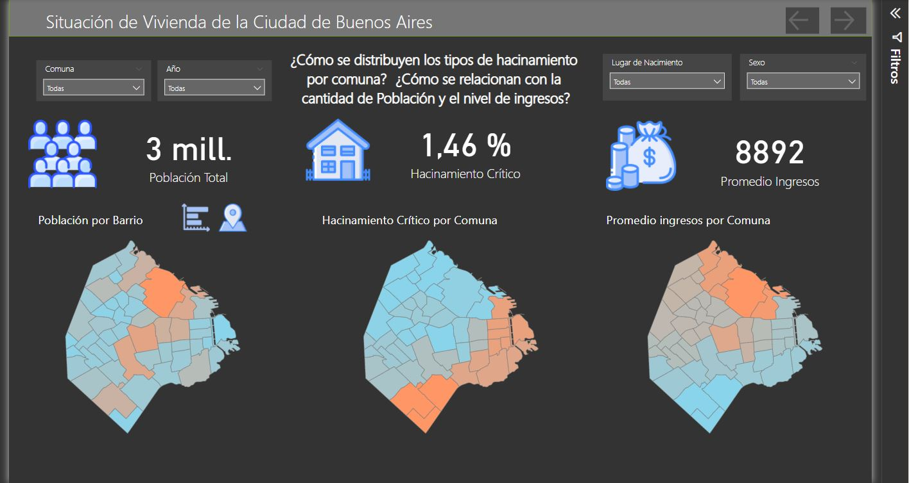
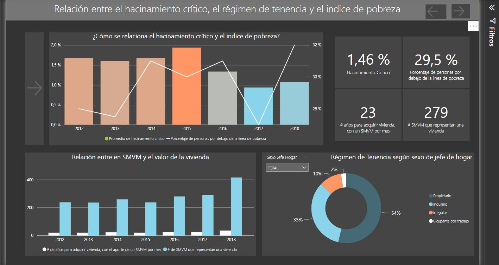
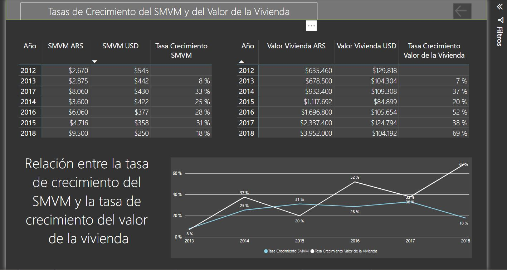

# Situación de Vivienda Buenos Aires Power BI.
Este fue un proyecto para el curso de Data Analyst de coderhouse, donde se recolectó, analizó y se presentó un dashboard interactivo con información sobre la situación de vivienda y calidad de vida de la ciudad de Buenos Aires.

Disponible en:
https://app.powerbi.com/view?r=eyJrIjoiNjkyMTYxYWEtNmI5Yi00MjA1LThhZmItYzczMGM5MDY0OTEzIiwidCI6Ijk5ZTFlNzIxLTcxODQtNDk4ZS04YWZmLWIyYWQ0ZTUzYzFjMiIsImMiOjR9&pageName=ReportSection19d3a4e0cfcac9bab77f
Avaliable on: https://app.powerbi.com/view?r=eyJrIjoiNjkyMTYxYWEtNmI5Yi00MjA1LThhZmItYzczMGM5MDY0OTEzIiwidCI6Ijk5ZTFlNzIxLTcxODQtNDk4ZS04YWZmLWIyYWQ0ZTUzYzFjMiIsImMiOjR9&pageName=ReportSection19d3a4e0cfcac9bab77f

